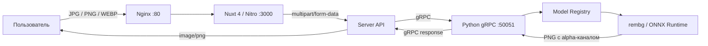
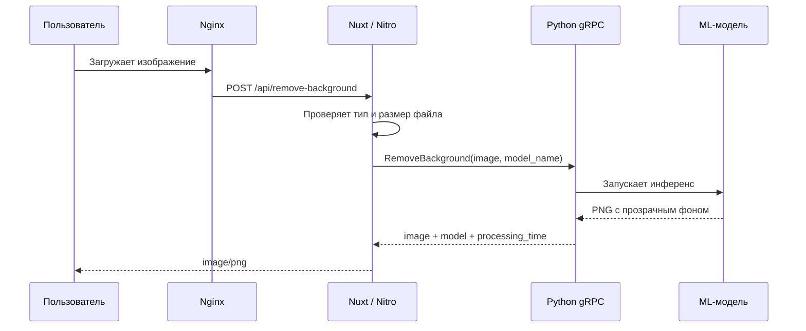

# Background Removal Service

<p align="center">
Современный веб-сервис для автоматического удаления фона с изображений.
</p>

<p align="center">
Nuxt 4 • Vue 3 • Python 3.11 • gRPC • Docker • Nginx
</p>

<p align="center">

</p>

<p align="center">


</p>

------------------------------------------------------------------------

## Содержание

-   [О проекте](#о-проекте)
-   [Возможности](#возможности)
-   [Как работает сервис](#как-работает-сервис)
-   [Режимы обработки](#режимы-обработки)
-   [Архитектура](#архитектура)
-   [Технологии](#технологии)
-   [Структура проекта](#структура-проекта)
-   [Требования](#требования)
-   [Быстрый запуск](#быстрый-запуск)
-   [API](#api)
-   [gRPC-контракт](#grpc-контракт)
-   [Проверки и ограничения](#проверки-и-ограничения)
-   [Конфигурация](#конфигурация)
-   [Добавление новой модели](#добавление-новой-модели)
-   [Текущий статус](#текущий-статус)
-   [Дальнейшее развитие](#дальнейшее-развитие)

------------------------------------------------------------------------

## О проекте

Веб-сервис для автоматического удаления фона с изображений. Пользователь
загружает фотографию, выбирает подходящий режим обработки и получает PNG
с прозрачным фоном.

Проект собран как полноценный MVP: Nuxt-интерфейс принимает изображение,
серверная часть Nuxt передаёт его Python-сервису по gRPC, ML-модель
удаляет фон, а Nginx выступает единой точкой входа.

> Дальше без изменений вставляется содержимое твоего текущего README,
> начиная с раздела **«Возможности»**.
## Возможности

- загрузка изображений в форматах JPG, PNG и WEBP;
- drag-and-drop и выбор файла через системное окно;
- проверка формата и размера изображения до обработки;
- выбор одной из трёх моделей с разным балансом скорости и качества;
- предпросмотр исходного изображения;
- удаление фона с сохранением прозрачности;
- отображение результата на клетчатой подложке;
- скачивание результата в формате PNG;
- отображение времени обработки и использованной модели;
- обработка ошибок без перезагрузки страницы;
- запуск всего приложения одной командой через Docker Compose.

## Как работает сервис



Браузер не обращается к Python-сервису напрямую. Все пользовательские запросы проходят через Nuxt/Nitro, который выполняет роль BFF и преобразует HTTP-запросы в gRPC-вызовы.

### Последовательность обработки



## Режимы обработки

Доступные модели описаны в `backend/config/models.json` и загружаются через единый реестр.

| Режим | Модель | Назначение |
|---|---|---|
| Быстро | `isnet-general-use` | Повседневные изображения и минимальное время ожидания |
| Оптимально | `birefnet-general-lite` | Сложные контуры и хороший баланс скорости и качества |
| Максимум | `birefnet-general` | Тонкие детали и максимальное качество обработки |

Модели можно включать, отключать и дополнять через конфигурацию без изменения gRPC-контракта.

## Архитектура

Проект организован как монорепозиторий и состоит из трёх запускаемых сервисов.

### Nginx

- принимает все внешние HTTP-запросы;
- проксирует их во frontend-контейнер;
- ограничивает размер тела запроса;
- использует увеличенные тайм-ауты для ML-инференса;
- включает gzip для текстовых ресурсов;
- предоставляет собственный health check.

### Frontend

- Nuxt 4, Vue 3 и TypeScript;
- Pinia для состояния интерфейса;
- адаптивная рабочая зона загрузки и результата;
- Nitro Server API как BFF;
- валидация MIME-типа и ограничения в 10 МБ;
- преобразование gRPC-ошибок в понятные HTTP-ответы;
- получение списка моделей с Python-сервиса.

### Backend

- Python 3.11;
- асинхронный сервер на `grpc.aio`;
- общий Protocol Buffers-контракт;
- `ModelRegistry` для управления доступными моделями;
- `rembg` и ONNX Runtime для инференса;
- выполнение CPU-bound обработки вне event loop;
- измерение времени обработки каждого изображения;
- кэширование загруженных весов в Docker volume.

## Технологии

| Слой | Технологии                      |
|---|---------------------------------|
| Интерфейс | Nuxt 4, Vue 3, TypeScript, SCSS |
| Состояние | Pinia                           |
| BFF | Nitro Server API                |
| Транспорт | gRPC, Protocol Buffers          |
| ML-сервис | Python 3.11, `grpc.aio`         |
| Инференс | rembg, ONNX Runtime             |
| Инфраструктура | Docker, Docker Compose, Nginx   |

## Структура проекта

```text
background-removal-service/
├── backend/
│   ├── config/               # конфигурация моделей и приложения
│   ├── models/               # реестр и обработчик удаления фона
│   ├── proto/                # сгенерированный Python-код protobuf
│   ├── server/               # gRPC-сервис и запуск сервера
│   ├── Dockerfile
│   ├── main.py
│   └── requirements*.txt
├── frontend/
│   ├── app/
│   │   ├── assets/           # SCSS и стили интерфейса
│   │   ├── components/       # компоненты страницы
│   │   ├── pages/            # страницы Nuxt
│   │   └── stores/           # Pinia stores
│   ├── server/
│   │   ├── api/              # HTTP API браузера
│   │   └── grpc/             # gRPC-клиент Python-сервиса
│   ├── Dockerfile
│   ├── nuxt.config.ts
│   └── package.json
├── nginx/
│   └── default.conf
├── proto/
│   └── background_removal.proto
├── docker-compose.yml
└── README.md
```

## Требования

Для запуска через контейнеры достаточно:

- Docker Engine;
- Docker Compose v2;
- минимум 8–12 ГБ свободной оперативной памяти для одновременной работы нескольких моделей;
- доступ к интернету при первом запуске для загрузки весов.

Тяжёлые модели требуют заметно больше памяти и времени, чем быстрый режим. На CPU первый запрос также может выполняться дольше из-за загрузки модели.

## Быстрый запуск

```bash
git clone https://github.com/SusanWay/background-removal-service.git
cd background-removal-service
docker compose up --build
```

После успешного запуска приложение будет доступно по адресу:

```text
http://localhost
```

При первом запуске backend загрузит веса выбранных моделей. Они сохраняются в Docker volume `background-removal-model-cache`, поэтому повторно скачивать их после перезапуска контейнера не потребуется.

### Запуск в фоне

```bash
docker compose up --build -d
```

### Просмотр логов

```bash
docker compose logs -f
```

Логи отдельного сервиса:

```bash
docker compose logs -f backend
docker compose logs -f frontend
docker compose logs -f nginx
```

### Остановка

```bash
docker compose down
```

Чтобы дополнительно удалить кэш весов:

```bash
docker compose down -v
```

## API

### `POST /api/remove-background`

Принимает `multipart/form-data`:

| Поле | Тип | Описание |
|---|---|---|
| `image` | File | Изображение JPG, PNG или WEBP размером до 10 МБ |
| `modelName` | string | Уникальное имя выбранной модели |

Успешный ответ:

- `Content-Type: image/png`;
- тело ответа содержит PNG с прозрачным фоном;
- `X-Model-Name` содержит имя использованной модели;
- `X-Processing-Time-Ms` содержит время обработки.

Пример запроса:

```bash
curl -X POST http://localhost/api/remove-background \
  -F "image=@./photo.jpg" \
  -F "modelName=isnet-general-use" \
  --output background-removed.png
```

## gRPC-контракт

Общий контракт находится в `proto/background_removal.proto` и используется как frontend-, так и backend-частью.

Сервис предоставляет два метода:

```proto
rpc GetModels(GetModelsRequest) returns (GetModelsResponse);
rpc RemoveBackground(RemoveBackgroundRequest)
    returns (RemoveBackgroundResponse);
```

`GetModels` возвращает доступные режимы обработки, а `RemoveBackground` принимает байты изображения и уникальное имя модели.

## Проверки и ограничения

- разрешены только `image/jpeg`, `image/png` и `image/webp`;
- максимальный размер входного файла — 10 МБ;
- Nginx принимает тело запроса размером до 12 МБ с учётом multipart-обвязки;
- результат всегда возвращается в PNG;
- Python-сервис не публикуется наружу и доступен только внутри Docker-сети;
- frontend запускается только после успешного health check backend;
- Nginx запускается только после готовности frontend.

## Конфигурация

Основные переменные окружения frontend-контейнера:

| Переменная | Значение по умолчанию | Назначение |
|---|---|---|
| `NUXT_GRPC_ADDRESS` | `127.0.0.1:50051` | Адрес Python gRPC-сервиса |
| `GRPC_PROTO_PATH` | путь к `.proto` в контейнере | Расположение protobuf-контракта |
| `HOST` | `0.0.0.0` | Интерфейс Nuxt-сервера |
| `PORT` | `3000` | Порт Nuxt-сервера |

В Docker Compose `NUXT_GRPC_ADDRESS` установлен в `backend:50051`.

## Добавление новой модели

Новая модель добавляется в `backend/config/models.json`:

```json
{
  "unique_name": "model-id",
  "name": "Название режима",
  "description": "Описание назначения модели",
  "provider": "rembg",
  "provider_model_name": "provider-model-id",
  "enabled": true
}
```

После перезапуска backend включённая модель попадёт в `ModelRegistry` и станет доступна через `GetModels`.

## Текущий статус

Реализован работающий MVP полного цикла:

- интерфейс загрузки и выбора модели;
- HTTP API на стороне Nuxt;
- связь Nuxt и Python через gRPC;
- три режима удаления фона;
- Docker-образы frontend и backend;
- общий Docker Compose;
- health checks и корректное ожидание готовности сервисов;
- Nginx как единственная внешняя точка входа.
